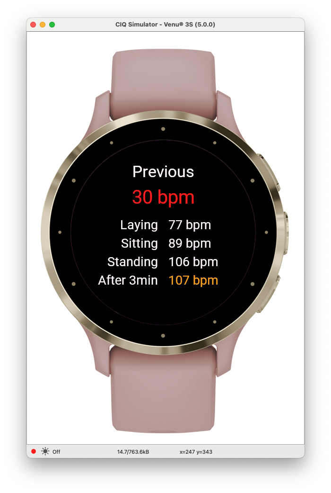
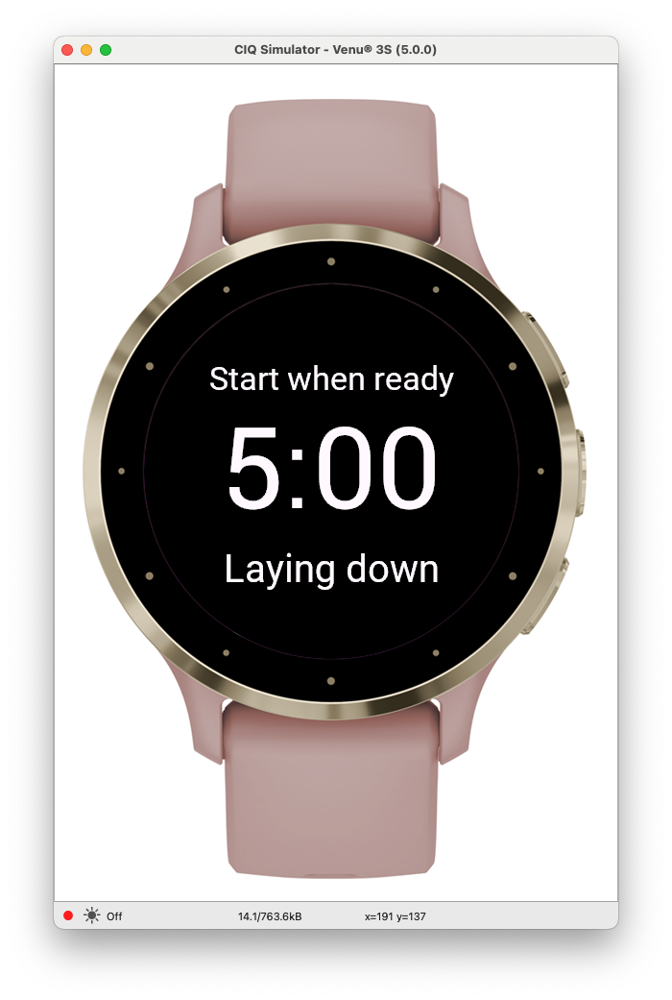
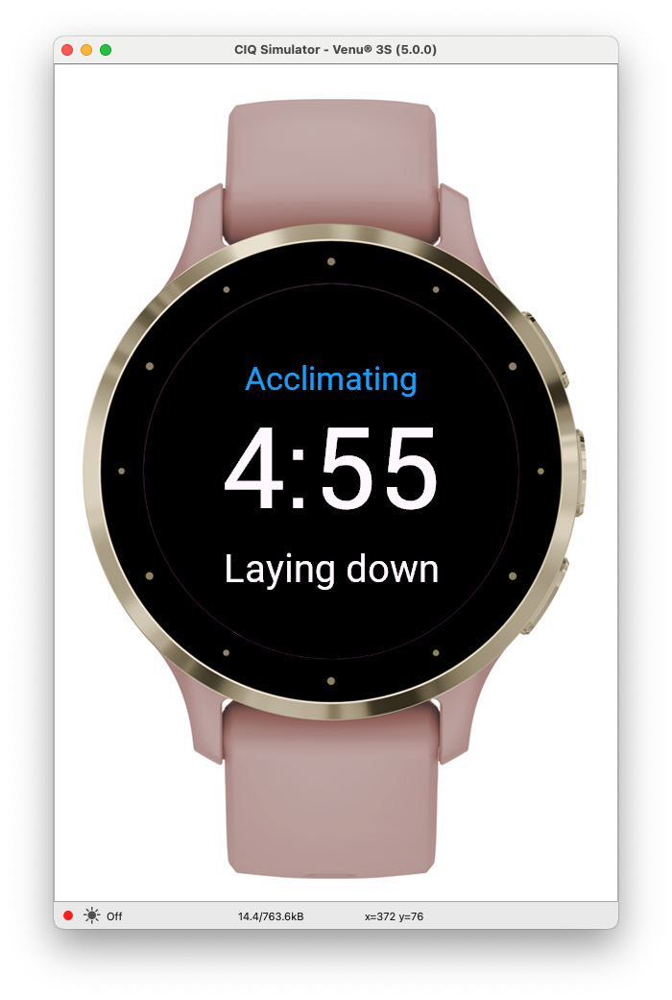

A simple little application to take periodic orthostatic tests.

<p align="center">
    
    
    
</p>

**Medical Research**

- [Agency for Healthcare Research and Quality - Orthostatic Vital Sign Measurement][]
- [Mayo Clinic - Orthostatic Hypotension / Postural Hypotension][]
- [National Library of Medicine - Orthostatic Hypotension][]

[Agency for Healthcare Research and Quality - Orthostatic Vital Sign Measurement]: https://www.ahrq.gov/patient-safety/settings/hospital/fall-prevention/toolkit/orthostatic-vital-sign.html
[Mayo Clinic - Orthostatic Hypotension / Postural Hypotension]: https://www.mayoclinic.org/diseases-conditions/orthostatic-hypotension/symptoms-causes/syc-20352548
[National Library of Medicine - Orthostatic Hypotension]: https://www.ncbi.nlm.nih.gov/books/NBK448192/

**Related to Physical Training**

- [Functional Training Institute](https://functionaltraininginstitute.com/orthostatic-heart-rate/)

**Garmin Watch Resources**

- [ConnectIQ Basics](https://developer.garmin.com/connect-iq/connect-iq-basics/your-first-app/)
- [Get the SDK](https://developer.garmin.com/connect-iq/sdk/)
- [Reference](https://developer.garmin.com/connect-iq/api-docs/)
- Owners manuals for devices...
- [OpenMTP](https://openmtp.ganeshrvel.com/)

## License

```
Copyright 2024 Mya Pitzeruse

Licensed under the Apache License, Version 2.0 (the "License");
you may not use this file except in compliance with the License.
You may obtain a copy of the License at

    http://www.apache.org/licenses/LICENSE-2.0

Unless required by applicable law or agreed to in writing, software
distributed under the License is distributed on an "AS IS" BASIS,
WITHOUT WARRANTIES OR CONDITIONS OF ANY KIND, either express or implied.
See the License for the specific language governing permissions and
limitations under the License.
```
